<h1 align="center">Hellloo Worlddd, I am Talha!!!</h1>

<p align="center">
  
</p>

---

# ⚡ ABOUT_ME.md

```cpp
class Talha
{
public:

    string role = "CS Undergraduate";

    vector<string> skills =
    {
        "C/C++",
        "Qt Development",
        "Front-end Web Development",
        "MySQL",
        "Python",
        "Machine Learning"
    };

    vector<string> interests =
    {
        "Generative AI",
        "Web-Development",
        "Software Development"
    };

};
```

---

# 🛠 TECH STACK

<p align="center">
  
  
  
  
  
  
  
  
  
  
</p>

---
# 🚀 FEATURED PROJECTS

### 🤖 [TRI-Chatbot-LLM](https://github.com/t4lhaa/TRI-Chatbot-LLM)
> An AI Chatbot which uses React+RAG, and gives quick useful responses.<br>
**Tech:** `Python` `LangChain` `LLMs`

### 🐍 [Snake And Ladder GUI](https://github.com/t4lhaa/SnakeAndLadder-GUI-Based)
> A classic Snake and Ladder game built with a complete Graphical User Interface.<br>
**Tech:** `C++` `Qt`

---

# 📊 STATS

<p align="center">
   <br>
   
</p>

---

# 🐍 CONTRIBUTION SNAKE

<p align="center">
  
</p>

---

# 🎯 CURRENT MISSIONS

- [ ] Learn Generative AI
- [ ] Learn Flutter
- [ ] Master AI and ML

---

# 🌐 CONNECT

<p align="center">
  <a href="https://www.linkedin.com/in/muhammad-talha-071913350" target="_blank" rel="noopener noreferrer">
    
  </a>
  <a href="https://mail.google.com/mail/?view=cm&to=muhammadtalha895c@gmail.com" target="_blank" rel="noopener noreferrer">
    
  </a>
  <a href="https://github.com/t4lhaa" target="_blank" rel="noopener noreferrer">
    
  </a>
</p>

<p align="center">
  
</p>
